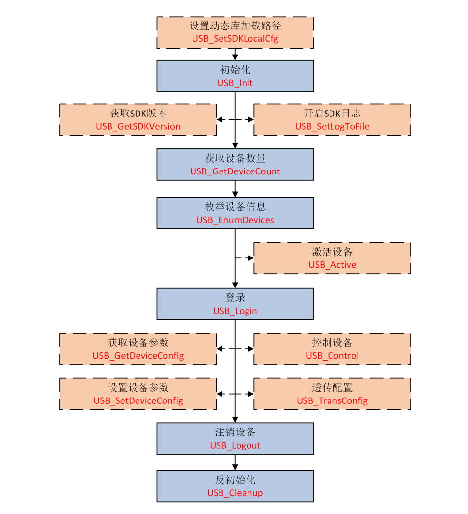
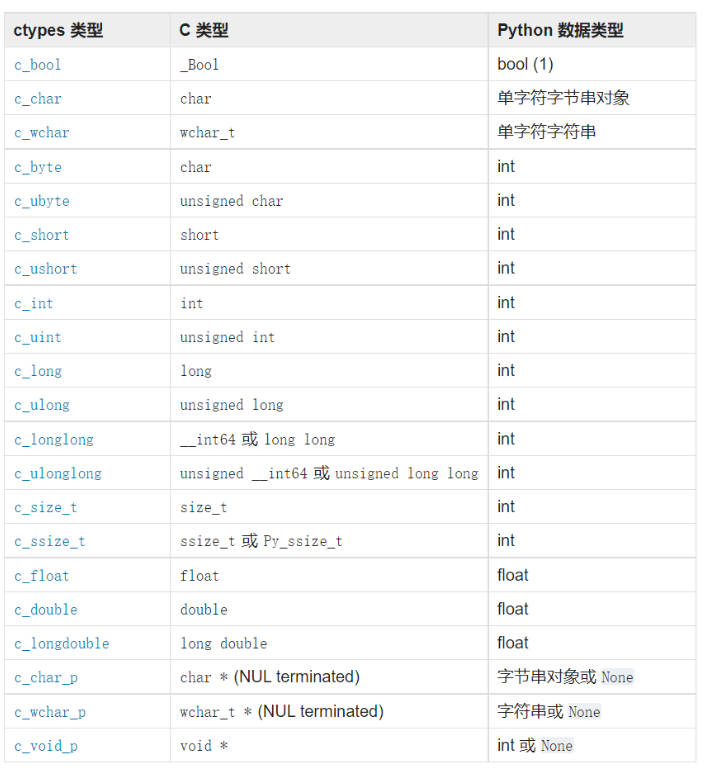

# 开发手册
海康云台开发工作流:

>具体开发时，使用官方提供的SDK进行，也可以使用RTSP协议进行开发，但前者经过优化基本没有延时，后者存在延时。
## 开发环境
+ 使用Python进行开发

    首先需要[下载官方SDK](https://open.hikvision.com/download/5cda567cf47ae80dd41a54b3?type=20&id=cd699e0e3def4519a6e8676f72e1ea1e)，云台提供多种接口通信，根据自己的通信环境和开发平台选不同的SDK。主要参考为开发平台的
系统、云台工作场景的网络环境（是否有固定IP、局域网IP等等）。

    平台开发环境：
    
    | 項目        | 版本                      |
    |-----------|-------------------------|
    | 操作系統      | Windows11 x64           |
    | python    | 3.7.16                  |
    | Opencv    | 3.4.1                   |
    | SDK       | HCUSBSDKV2.6.0.3_build20241219_win64_ZH | 

    SDK只提供DLL库，不直接提供python接口，需要使用ctypes库进行调用。本质上是通过ctypes调用c语言的数据类型、函数等再转化为
python对应的数据类型、函数。 将SDK的lib库拷贝到当前项目中。

+ 使用USBSDK无法操作云台，使用RS485可以控制云台运动但是没有反馈

 🎶基于USBSDK操作云台相机，需要使用USB将云台与主机相连接，然后即可使用。
在src目录下保存了使用USBSDK控制云台的示例代码，其中DevClass是流程基类，后续开发的新目标功能
需要继承自DevClass，并实现其中的StartWork、StopWork方法。
main.py时一个预览模式的标准例程

HCUSBSDK封装了用到的相关C结构体

ParamConfig可以用于设置相机参数

PelcoDControl是一个使用Pelco-D协议控制云台的类，接入RS485线到电脑与云台，可以实现云台的各种控制功能，包括上下左右、变倍、变焦、变速、回中。
由于未知原因，云台无法受控准确执行指定的运动流程。

FaceDetect是一个活物检查工程。

+ 使用NETSDK可以操作云台，但是需要先建立网络连接，然后才能控制云台。

👍NETSDK结合PLayCtrlSDK可以完成云台的控制和图像取流，但是帧率较低。相关脚本放在scripts目录下。

baseSdk是一套标准流程模板，后续开发的新目标功能
需要继承自DevClass，并实现其中的StartWork、StopWork方法。

HCNetSDK、INFOSTRUCT、PlayCtrlSDK封装了用到的相关C结构体

main.py实现了图像取流、云台控制、目标框选、目标追踪功能。并提供一个UI界面用于控制是否跟踪与结束工作。

videoAPP是一个简单得到UI界面，可以继续完善功能。

normal_detector是使用Opencv进行目标跟踪与二维码检测的封装，提供多种检测方式。

```python
pip install -r requirements.txt
python main.py
```

core、lib分别存放了NETSDK、USBSDK的库文件。